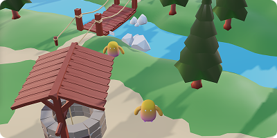

# Interactive Game Portfolio

This is the repo for my interactive open world portfolio project. It is built with React Three Fiber and the Rapier physics engine. The goal is for users to walk around the map to find out different pieces of infermation about me.

# MVP V1.0.0 Roadmap

I'm going to keep a list of everything that needs to be done here. For a more detailed breakdown of v2.0.0 [click here](docs/v2.md).

### Player Character

- Import model ✅
- Add character controller to move and rotate player ✅
- Add physics engine and collision detection ✅
- Add player dialog box ✅

### Map

- Import map model ✅
- Add water
- Add sounds when walking on different meshes

### Misc

- Design game controls UI
- Add music to game
- Add map for users to find their way round
- Add onboarding section to show users controls
- Title screen

### Bugs

- Character shouldn't move when clicked buttons or controls

# Storyline

This area needs work, but the idea right now is to keep it simple and just have a few NPC's someone can interact with to find out more information about you. I've listed these below but they need more information.

- Work experience (Sportsshoes, Money supermarket, Awaze)
- Personal - Love hiking, being in my van.
- Contact information
